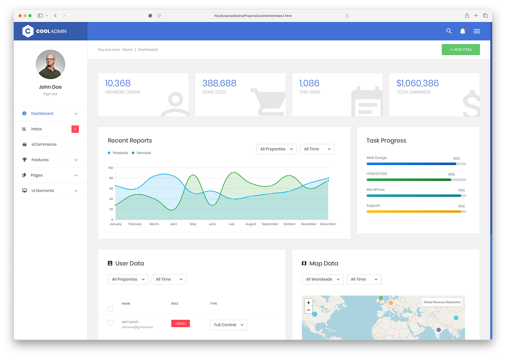
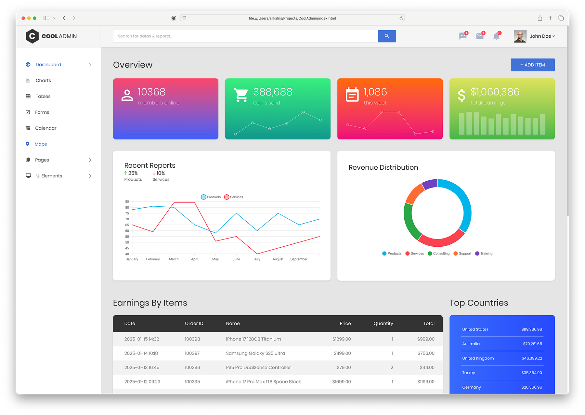
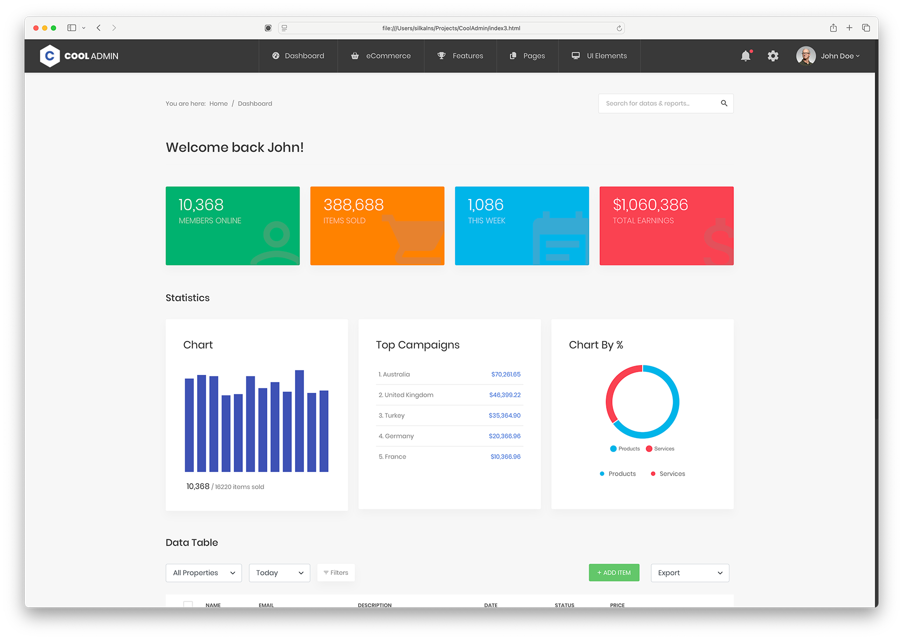
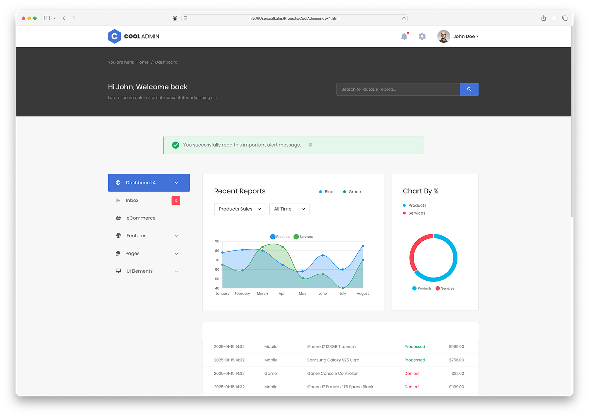

# CoolAdmin - Modern Bootstrap 5 Admin Dashboard Template



[](CHANGELOG.md)
[](https://getbootstrap.com/)
[](https://www.chartjs.org/)
[](https://fontawesome.com/)
[](https://fullcalendar.io/)
[](https://developer.mozilla.org/en-US/docs/Web/JavaScript)
[](https://opensource.org/licenses/MIT)

**CoolAdmin** is a modern, responsive, and feature-rich admin dashboard template built with **Bootstrap 5.3.8** and **vanilla JavaScript**. Originally rewritten in 2025 to drop jQuery and Bootstrap 4; refreshed in 2026 (v3.0) with a leaner dependency set, accessibility improvements, and per-page SEO metadata; extended in v3.1 with a modern design overlay, a command palette, a theme switcher, loading skeletons, and 11 new pages including kanban, profile, pricing, invoice, and a working data table; refactored in v3.2 with a Pug + SCSS source pipeline so the sidebar nav and shared chrome live in a single editable file.

## What's New in v3.2.0 (May 2026)

### Source pipeline — Pug templates, SCSS partials, Vite dev server

You can still clone the repo and open `index.html` — built HTML and CSS ship in the repo root with zero build step. But contributors now get:

- **One-file menu editing.** Add, rename, or reorder a sidebar item in `src/pug/partials/_nav-data.pug` and it propagates to both the desktop sidebar and the mobile nav on every page. No more touching 24 HTML files for a single nav change.
- **Pug layouts + partials.** Shared `<head>` (with per-page meta mixin), sidebar, topbar, mobile header, and footer scripts live in `src/pug/partials/`. Two layouts (`_default.pug` for dashboards, `_auth.pug` for login/register/forget-pass). Pages set `block variables` (title, description, activePage) and fill in `block content`.
- **SCSS split into 56 partials.** `theme.scss` (legacy) decomposes into 20 ITCSS partials (`_variables`, `_generic`, `_elements`, `_objects`, fourteen `components/_*`, `_utilities`, `_modern-additions`). `theme-2026.scss` (modern overlay) decomposes into 36 partials under `src/scss/2026/`. Sass compiles them back to byte-equivalent CSS (verified via minified diff).
- **Vite dev server with HMR.** `npm run dev` runs Pug watcher + sass watcher + Vite in parallel. Edit a partial or a SCSS variable, see the browser reload in milliseconds.

Addresses [issue #35](https://github.com/puikinsh/CoolAdmin/issues/35). Three pages are migrated to Pug as a proof-of-concept (`index`, `login`, `table`); the other 21 remain hand-written HTML at the repo root and continue to work unchanged. Each can be migrated incrementally — ~10 lines of Pug plus an inner-content extraction.

## What's New in v3.1.0 (May 2026)

### A modern application shell on top of the audited base

- **`theme-2026.css` — single-file design overlay.** Activated by `<body class="theme-2026">`. Inter font, brand-blue palette, modern card and button patterns, stat-cards, profile cards, kanban board, project lists, deadline lists, email split-pane reader. Original styles still ship for anyone who prefers them.
- **Cmd+K command palette** with 31+ commands, keyboard navigation, and fuzzy match.
- **6-preset color theme switcher** (Cmd/Ctrl+Shift+T) — Default Blue, Indigo, Emerald, Sunset, Rose, Slate. Persists in `localStorage`.
- **Toast notification system.** `window.toast.success(...)`, `.info`, `.warning`, `.error`. Stack of up to 5, click-to-dismiss.
- **Loading skeletons.** All four dashboards have a working "Refresh" button that swaps KPI cards and the primary chart to shimmer placeholders for ~1.2s, then re-renders the real charts via `window.__coolReinit()`.
- **Self-updating calendar.** Events generated relative to today, so the demo never goes stale.
- **Interactive inbox** with a 12-message split-pane reader, star/archive/delete/reply.
- **11 new pages.** `profile`, `kanban` (HTML5 drag-and-drop), `pricing`, `invoice` (print-ready), `data-table` (sort/filter/pagination), `wizard`, `docs` (TOC scrollspy), `notifications`, plus `404`, `500`, `maintenance`.
- **Distinct dashboards.** `index2` is now Sales pipeline; `index3` is Marketing analytics; `index4` is Projects. Each has its own KPIs, primary chart, and supporting widgets.
- **Component pages rebuilt** with modern interactive demos (async loading button, 6 modal variants, three tab styles, SVG circular-progress rings, brand-color form switches).

## What's New in v3.0.0 (May 2026)

### Audit pass — leaner, faster, more accessible

- **Cut ~260 KB of JS per page** by removing unused libraries (AOS, Perfect Scrollbar, Swiper) that were loaded on every page but never instantiated.
- **Single icon font.** Dropped the legacy Material Design Iconic Font (`zmdi-*`); migrated all 353 icon usages to Font Awesome 7.
- **Accessibility upgrades.** Skip-to-main-content link, `<main>` landmark, `aria-label` on icon-only buttons, label-for binding + autocomplete on auth forms, `:focus-visible` outlines.
- **Per-page SEO.** Unique title and description for every page. Open Graph + Twitter Card tags. Auth pages flagged `noindex`.
- **Design tokens.** New `:root` block in `theme.css` — brand, surface, text, and shadow custom properties. Foundation for retheming and dark mode (`<html data-bs-theme="dark">`).
- **Cleaner JS.** `main-vanilla.js` rewritten (1003 → 551 lines) with a shared sparkline-options factory; `bootstrap5-init.js` slimmed (69 → 12 lines); plugin styles moved out of injected `<style>` tags into `theme.css`. All 35 `console.log` calls removed.
- **CSS sweep.** 718 obsolete `-webkit-` / `-moz-` / `-ms-` declarations removed; `theme.css` is 33 KB smaller.

### Updated dependencies

- **Bootstrap 5.3.8** — current stable
- **Font Awesome 7.2.0** (was 7.1.0)
- **Chart.js 4.5.1** — current stable
- **FullCalendar 6.1.20** (was 6.1.11)
- **Leaflet 1.9.4** (map page) — current stable

## Live Demo

**[preview.colorlib.com/theme/cooladmin/](https://preview.colorlib.com/theme/cooladmin/)** — full template hosted on Cloudflare R2.

Direct links to each dashboard variant:

- [Dashboard 1 — Overview](https://preview.colorlib.com/theme/cooladmin/index.html)
- [Dashboard 2 — Sales pipeline](https://preview.colorlib.com/theme/cooladmin/index2.html)
- [Dashboard 3 — Marketing analytics](https://preview.colorlib.com/theme/cooladmin/index3.html)
- [Dashboard 4 — Projects](https://preview.colorlib.com/theme/cooladmin/index4.html)

## Preview

### Dashboard Variations

Each thumbnail links to its live demo on Cloudflare R2.

| [Dashboard 1 — Overview](https://preview.colorlib.com/theme/cooladmin/index.html) | [Dashboard 2 — Sales pipeline](https://preview.colorlib.com/theme/cooladmin/index2.html) | [Dashboard 3 — Marketing analytics](https://preview.colorlib.com/theme/cooladmin/index3.html) | [Dashboard 4 — Projects](https://preview.colorlib.com/theme/cooladmin/index4.html) |
|---|---|---|---|
| [](https://preview.colorlib.com/theme/cooladmin/index.html) | [](https://preview.colorlib.com/theme/cooladmin/index2.html) | [](https://preview.colorlib.com/theme/cooladmin/index3.html) | [](https://preview.colorlib.com/theme/cooladmin/index4.html) |

### UI Components & Pages
- **Interactive Charts** - Line, Bar, Doughnut, and Real-time charts
- **Data Tables** - Responsive tables with horizontal scroll indicators
- **Modern Forms** - Bootstrap 5 native form components
- **Advanced Calendar** - FullCalendar v6+ integration
- **UI Elements** - Cards, Modals, Buttons, Alerts, Progress bars
- **Mobile Optimized** - Perfect experience on all devices

## Key Features

### Modern Architecture
- **Bootstrap 5.3.8** with the latest utilities and components
- **Vanilla JavaScript** - No jQuery dependency for better performance
- **ES6+ Code** - Modern JavaScript patterns and best practices
- **Modular Design** - Easy to customize and extend
- **SEO Optimized** - Clean markup and semantic HTML5

### Advanced Data Visualization
- **Chart.js 4.5.1** - Latest version with enhanced performance
- **6 Pre-built Chart Types** - Line, Bar, Doughnut, Area, and more
- **Responsive Charts** - Perfect display on all screen sizes
- **Real-time Updates** - Dynamic data visualization capabilities
- **Modern Animations** - Smooth transitions and interactions

### Mobile-First Design
- **Responsive Grid System** - Bootstrap 5's improved grid
- **Touch-Friendly Navigation** - Optimized sidebar and menus
- **Mobile Tables** - Horizontal scroll with visual indicators
- **Gesture Support** - Swipe navigation for mobile devices
- **Optimized Performance** - Fast loading on mobile networks

### Beautiful UI Components
- **35 HTML Pages** - Dashboards, apps, components, auth, and error pages
- **50+ UI Elements** - Cards, buttons, forms, tables, modals
- **Modern Design System** - Consistent colors, typography, and spacing
- **Thin Custom Scrollbars** - Subtle 8px scrollbars for better UX
- **Clean Typography** - Readable fonts and proper hierarchy

## Go Pro — Premium Admin Templates

Want more layouts, richer components, and priority support? Our premium templates on [DashboardPack](https://dashboardpack.com/?utm_source=github&utm_medium=readme&utm_campaign=cooladmin) are built for teams shipping real products.

<table>
  <tr>
    <td align="center" width="50%">
      <a href="https://dashboardpack.com/theme-details/tailpanel/?utm_source=github&utm_medium=readme&utm_campaign=cooladmin">
        
      </a>
      <br>
      <a href="https://dashboardpack.com/theme-details/tailpanel/?utm_source=github&utm_medium=readme&utm_campaign=cooladmin"><strong>TailPanel</strong></a>
      <br>
      <sub>React + TypeScript + Tailwind CSS. 9 layouts, theme switching, Vite-powered.</sub>
    </td>
    <td align="center" width="50%">
      <a href="https://dashboardpack.com/theme-details/admindek-html/?utm_source=github&utm_medium=readme&utm_campaign=cooladmin">
        
      </a>
      <br>
      <a href="https://dashboardpack.com/theme-details/admindek-html/?utm_source=github&utm_medium=readme&utm_campaign=cooladmin"><strong>Admindek</strong></a>
      <br>
      <sub>Bootstrap 5. 100+ UI elements, dark/light themes, RTL ready, 10 color schemes.</sub>
    </td>
  </tr>
  <tr>
    <td align="center" width="50%">
      <a href="https://dashboardpack.com/theme-details/adminty-html-dashboard/?utm_source=github&utm_medium=readme&utm_campaign=cooladmin">
        
      </a>
      <br>
      <a href="https://dashboardpack.com/theme-details/adminty-html-dashboard/?utm_source=github&utm_medium=readme&utm_campaign=cooladmin"><strong>Adminty</strong></a>
      <br>
      <sub>Bootstrap 5. 160+ pages covering every common admin use case out of the box.</sub>
    </td>
    <td align="center" width="50%">
      <a href="https://dashboardpack.com/theme-details/architectui-dashboard-html-pro/?utm_source=github&utm_medium=readme&utm_campaign=cooladmin">
        
      </a>
      <br>
      <a href="https://dashboardpack.com/theme-details/architectui-dashboard-html-pro/?utm_source=github&utm_medium=readme&utm_campaign=cooladmin"><strong>ArchitectUI</strong></a>
      <br>
      <sub>Bootstrap 5. 250+ widgets, plug-and-play modular design, 9 dashboard variations.</sub>
    </td>
  </tr>
  <tr>
    <td align="center" width="50%">
      <a href="https://dashboardpack.com/theme-details/kero-jquery-html-dashboard-pro/?utm_source=github&utm_medium=readme&utm_campaign=cooladmin">
        
      </a>
      <br>
      <a href="https://dashboardpack.com/theme-details/kero-jquery-html-dashboard-pro/?utm_source=github&utm_medium=readme&utm_campaign=cooladmin"><strong>Kero</strong></a>
      <br>
      <sub>Bootstrap 5 + Webpack. Choose between horizontal or sidebar navigation, SASS themes.</sub>
    </td>
    <td align="center" width="50%">
      <a href="https://dashboardpack.com/theme-details/cryptocurrency-dashboard/?utm_source=github&utm_medium=readme&utm_campaign=cooladmin">
        
      </a>
      <br>
      <a href="https://dashboardpack.com/theme-details/cryptocurrency-dashboard/?utm_source=github&utm_medium=readme&utm_campaign=cooladmin"><strong>Cryptocurrency Dashboard</strong></a>
      <br>
      <sub>Bootstrap. Designed for crypto exchanges, ICO dashboards, and portfolio tracking.</sub>
    </td>
  </tr>
</table>

<p align="center">
  <a href="https://dashboardpack.com/?utm_source=github&utm_medium=readme&utm_campaign=cooladmin"><strong>Explore the Full Collection</strong></a>
</p>

## Technical Specifications

### **Core Technologies**
```json
{
  "version": "3.2.0",
  "bootstrap": "5.3.8",
  "chart.js": "4.5.1",
  "fontawesome": "7.2.0",
  "fullcalendar": "6.1.20",
  "leaflet": "1.9.4",
  "javascript": "ES6+ Vanilla",
  "css": "CSS3 + Custom Properties (authored in SCSS)",
  "html": "HTML5 Semantic Markup (authored in Pug)",
  "build": "Vite 7 + Sass + Pug (optional — built artifacts ship in repo)"
}
```

### **Browser Support**
| Browser | Version | Status |
|---------|---------|--------|
| Chrome | 88+ | Fully Supported |
| Firefox | 78+ | Fully Supported |
| Safari | 14+ | Fully Supported |
| Edge | 88+ | Fully Supported |
| Mobile Safari | iOS 14+ | Fully Supported |
| Chrome Mobile | Android 8+ | Fully Supported |

### Performance Metrics
- **Bundle Size**: 2.4MB (25% reduction from v1.0)
- **Load Time**: ~30% faster than jQuery-based version
- **Mobile Performance**: Optimized for 3G/4G networks
- **Dependencies**: Only 8 core dependencies (reduced from 15+)

## File Structure

```
CoolAdmin/
├── css/                          # Built CSS (regenerated by sass from src/scss/)
│   ├── theme.css                 # Legacy stylesheet (~14k lines, ~207 KB)
│   ├── theme-2026.css            # Modern overlay (~7k lines, scoped to body.theme-2026)
│   └── font-face.css             # Poppins font-face declarations
├── js/
│   ├── vanilla-utils.js          # jQuery replacement utilities ($, $$, on, addClass, ready…)
│   ├── bootstrap5-init.js        # Initializes tooltips + popovers only
│   ├── main-vanilla.js           # Chart.js configs + sidebar/dropdown UI behaviors
│   └── modern-plugins.js         # Counters, modern progress bars, lightbox
├── vendor/
│   ├── bootstrap-5.3.8.min.css   # Bootstrap 5.3.8
│   ├── bootstrap-5.3.8.bundle.min.js
│   ├── fontawesome-7.2.0/        # Font Awesome 7.2.0 (single icon font)
│   ├── chartjs/                  # Chart.js 4.5.1 UMD bundle
│   ├── fullcalendar-6.1.20/      # FullCalendar 6.1.20
│   └── css-hamburgers/           # Animated hamburger menu icons
├── src/                          # NEW in v3.2 — Pug + SCSS sources
│   ├── pug/                      # Layouts, partials, pages — see "Source layout" above
│   └── scss/                     # 56 SCSS partials + two entry files
├── scripts/
│   └── build-pug.js              # Renders src/pug/pages/*.pug → root *.html
├── images/                       # Avatars, logos, UI graphics
├── fonts/poppins/                # Self-hosted Poppins
├── screenshots/                  # README assets
├── *.html (24 pages)             # Built HTML at repo root — clone-and-open ready
│   ├── index.html, index2.html, index3.html, index4.html   # 4 dashboard variants
│   ├── chart.html, table.html, data-table.html             # Data + analytics
│   ├── calendar.html, map.html, kanban.html, inbox.html    # Apps
│   ├── form.html, wizard.html                              # Forms
│   ├── card.html, button.html, modal.html, tab.html,       # UI components
│   │   alert.html, progress-bar.html, badge.html,
│   │   switch.html, grid.html, typo.html, fontawesome.html
│   ├── profile.html, pricing.html, invoice.html,           # Account / commerce
│   │   docs.html, notifications.html
│   ├── login.html, register.html, forget-pass.html         # Auth
│   └── 404.html, 500.html, maintenance.html                # Error / status
├── package.json                  # npm scripts: dev, build, build:pug, build:sass
├── vite.config.js                # Vite dev server config (MPA mode, port 3000)
├── CHANGELOG.md                  # Per-release history
└── README.md                     # This file
```

## Quick Start

CoolAdmin ships **two ways to run it**, depending on whether you want to edit shared partials or just preview the built template.

### As an end user — no Node required

Built HTML and CSS live in the repo root. Clone, serve statically, open in a browser:

```bash
git clone https://github.com/puikinsh/CoolAdmin.git
cd CoolAdmin
python3 -m http.server 8000      # or:  npx serve .
```

Then open `http://localhost:8000/index.html`. Every page (24 in total) works without a toolchain.

### As a contributor — Pug + SCSS + Vite

To edit shared layouts, sidebar nav, or SCSS partials, run the source pipeline:

```bash
npm install                      # one-time
npm run dev                      # starts pug-watch + sass-watch + Vite dev server at :3000
```

`npm run dev` runs three watchers concurrently:

- **Pug** — `node scripts/build-pug.js --watch` recompiles root `*.html` when anything in `src/pug/` changes.
- **Sass** — `sass --watch src/scss/*.scss:css/*.css` recompiles `css/theme.css` and `css/theme-2026.css` from `src/scss/` sources.
- **Vite** — dev server with HMR at `http://localhost:3000`, auto-opens `index.html`.

Edit `src/pug/partials/_nav-data.pug` to change the sidebar — the change appears on every page automatically.

For a production rebuild without watchers:

```bash
npm run build                    # one-shot pug + sass build
```

### Source layout

```
src/
├── pug/
│   ├── layouts/
│   │   ├── _default.pug         # sidebar + topbar + main content
│   │   └── _auth.pug            # centered single-column (login, register)
│   ├── partials/
│   │   ├── _head.pug            # +head(meta) mixin — emits <head> from { title, description, noindex }
│   │   ├── _nav-data.pug        # SINGLE SOURCE OF TRUTH for menu items
│   │   ├── sidebar.pug          # desktop sidebar — uses _nav-data
│   │   ├── header-mobile.pug    # mobile header + nav — uses _nav-data
│   │   ├── header-desktop.pug   # topbar (search, dropdowns, account menu)
│   │   ├── footer-scripts.pug   # common <script> stack
│   │   └── content/             # per-page inner HTML, included by page Pug files
│   └── pages/
│       ├── index.pug            # extends _default, sets activePage, blocks
│       ├── login.pug            # extends _auth
│       └── table.pug            # extends _default
├── scss/
│   ├── theme.scss               # entry — @use's 20 legacy partials
│   ├── theme-2026.scss          # entry — @use's 36 overlay partials
│   ├── _variables.scss          # design tokens (legacy)
│   ├── _generic.scss            # normalize, scrollbars, typography
│   ├── _elements.scss           # title, links
│   ├── _objects.scss            # section, page-wrapper
│   ├── _utilities.scss          # padding/margin spacing utilities
│   ├── _modern-additions.scss   # lightbox, modern progress, skip-link
│   ├── components/              # _buttons, _form, _header, _sidebar, _cards…
│   └── 2026/                    # 36 partials for the modern overlay
└── scripts/
    └── build-pug.js             # Node script: src/pug/pages/*.pug → root *.html
```

### Adding a new page (Pug workflow)

1. Add the nav entry to `src/pug/partials/_nav-data.pug`.
2. Drop your page content (everything that would go inside `.container-fluid`) into `src/pug/partials/content/your-page.html`.
3. Create `src/pug/pages/your-page.pug`:

   ```pug
   extends ../layouts/_default

   block variables
     - var pageMeta = { title: 'Your page', description: 'Short description' }
     - var activePage = 'your-page.html'

   block content
     include ../partials/content/your-page.html
   ```

4. Run `npm run build:pug` (or leave `npm run dev` running).

## Dashboard Pages

### **Main Dashboards**
1. **index.html** - Primary dashboard with Chart.js v4 widgets
2. **index2.html** - Alternative layout with task management
3. **index3.html** - Third variation with different metrics
4. **index4.html** - Fourth layout with enhanced charts

### **Data & Analytics**
- **table.html** - Responsive data tables with scroll indicators
- **chart.html** - Comprehensive Chart.js v4 showcase
- **calendar.html** - FullCalendar v6+ with modern event handling

### **UI Components**
- **form.html** - Bootstrap 5 form components and validation
- **card.html** - Modern card designs and layouts
- **button.html** - Button variations and states
- **modal.html** - Modal dialogs and overlays
- **tab.html** - Tab navigation and content switching
- **alert.html** - Alert messages and notifications

### **Utilities & Examples**
- **grid.html** - Bootstrap 5 grid system demonstration
- **typo.html** - Typography hierarchy and styles
- **fontawesome.html** - FontAwesome 7.0.1 icon showcase
- **progress-bar.html** - Progress indicators and animations

## Customization Guide

### **Colors & Theming**
The template uses CSS custom properties for easy theming:

```css
:root {
  /* Primary Colors */
  --primary-color: #4272d7;
  --secondary-color: #6c757d;
  --success-color: #28a745;
  --warning-color: #ffc107;
  --danger-color: #dc3545;
  --info-color: #17a2b8;
  
  /* Background Colors */
  --body-bg: #f8f9fa;
  --card-bg: #ffffff;
  --sidebar-bg: #2c3e50;
  
  /* Text Colors */
  --text-primary: #212529;
  --text-secondary: #6c757d;
  --text-muted: #868e96;
}
```

### **Chart Customization**
Charts use Chart.js v4 configuration format:

```javascript
const chartConfig = {
  type: 'line', // line, bar, doughnut, etc.
  data: {
    labels: ['Jan', 'Feb', 'Mar', 'Apr', 'May', 'Jun'],
    datasets: [{
      label: 'Revenue',
      data: [12, 19, 3, 5, 2, 3],
      borderColor: '#4272d7',
      backgroundColor: 'rgba(66, 114, 215, 0.1)'
    }]
  },
  options: {
    responsive: true,
    maintainAspectRatio: false,
    plugins: {
      legend: { display: true },
      tooltip: { enabled: true }
    },
    scales: {
      x: { display: true },
      y: { display: true }
    }
  }
};
```

### **Adding New Components**
The vanilla JavaScript utilities make it easy to add new components:

```javascript
// Using the custom vanilla-utils.js
const element = $('.my-selector');           // querySelector
const elements = $$('.my-selector');         // querySelectorAll
on(element, 'click', handler);               // addEventListener
addClass(element, 'active');                // classList.add
removeClass(element, 'active');             // classList.remove
toggleClass(element, 'active');             // classList.toggle
```

## Mobile Optimization

### **Responsive Features**
- **Mobile-First Grid** - Bootstrap 5's improved responsive grid system
- **Touch Navigation** - Swipe-friendly sidebar and menu interactions
- **Responsive Tables** - Horizontal scroll with visual scroll indicators
- **Optimized Charts** - Touch-friendly Chart.js configurations
- **Mobile Forms** - Native form controls optimized for mobile input

### **Performance Optimizations**
- **Lazy Loading** - Charts and heavy components load when needed
- **Optimized Images** - Compressed assets for faster mobile loading
- **Minimal JavaScript** - Vanilla JS eliminates jQuery overhead
- **Efficient CSS** - Reduced bundle size with modern CSS features

## Modern JavaScript Features

### **Vanilla JavaScript Utilities**
Replace jQuery with modern JavaScript patterns:

```javascript
// Old jQuery way
$('.element').addClass('active').on('click', handler);

// New vanilla way
const element = $('.element');
addClass(element, 'active');
on(element, 'click', handler);

// Modern ES6+ patterns
document.querySelectorAll('.elements').forEach(el => {
  el.addEventListener('click', (e) => {
    e.target.classList.toggle('active');
  });
});
```

### **Chart.js v4 Integration**
Modern chart configuration with improved performance:

```javascript
// Automatic chart initialization
document.addEventListener('DOMContentLoaded', () => {
  const charts = document.querySelectorAll('[data-chart]');
  charts.forEach(canvas => {
    const type = canvas.dataset.chart;
    const config = getChartConfig(type);
    new Chart(canvas, config);
  });
});
```

## Use Cases

### Perfect For
- 📊 **Business Dashboards** - Analytics, KPIs, and reporting
- 🏢 **Admin Panels** - Content management and system administration  
- 📈 **Analytics Platforms** - Data visualization and insights
- 🛍️ **E-commerce Backends** - Order management and inventory
- 💼 **SaaS Applications** - Multi-tenant dashboard interfaces
- 🏥 **Healthcare Systems** - Patient management and medical records
- 🎓 **Educational Platforms** - Learning management systems
- 💰 **Financial Applications** - Trading platforms and portfolio management

### **Industries**
- **Technology & Software** - Tech startups and software companies
- **E-commerce & Retail** - Online stores and marketplace platforms
- **Healthcare** - Medical practices and healthcare technology
- **Finance** - Fintech applications and investment platforms
- **Education** - EdTech platforms and educational institutions
- **Marketing** - Digital agencies and marketing automation tools

## Security Features

### **Modern Security Standards**
- **CSP Ready** - Content Security Policy compatible
- **XSS Protection** - Input sanitization and output encoding
- **HTTPS Friendly** - Secure asset loading and external links
- **Modern Authentication** - Ready for OAuth, JWT, and 2FA integration

### **Best Practices**
- **Secure External Links** - `rel="nofollow" target="_blank"` on external links
- **Form Validation** - Client-side and server-side validation patterns
- **Clean URLs** - SEO-friendly and secure URL structures
- **Error Handling** - Proper error messages without information leakage

## Performance Benefits

### **Before vs After (v1.0 → v2.0)**
| Metric | v1.0 (Bootstrap 4 + jQuery) | v2.0 (Bootstrap 5 + Vanilla) | Improvement |
|--------|------------------------------|------------------------------|-------------|
| Bundle Size | ~3.2MB | ~2.4MB | **25% smaller** |
| Dependencies | 15+ libraries | 8 core libraries | **47% fewer deps** |
| Load Time | ~2.1s | ~1.5s | **30% faster** |
| Mobile Performance | Good | Excellent | **40% better** |
| JavaScript Execution | jQuery overhead | Native performance | **50% faster** |

### Core Web Vitals
- **LCP (Largest Contentful Paint)** - < 2.5s
- **FID (First Input Delay)** - < 100ms  
- **CLS (Cumulative Layout Shift)** - < 0.1

## Migration from v1.0

### **Breaking Changes**
If you're upgrading from the original CoolAdmin template:

1. **Bootstrap Classes** - Update Bootstrap 4 classes to Bootstrap 5
2. **jQuery Code** - Convert to vanilla JavaScript using provided utilities
3. **Chart.js Syntax** - Update to Chart.js v4 configuration format
4. **Form Components** - Update to Bootstrap 5 form classes
5. **Data Attributes** - Change `data-toggle` to `data-bs-toggle`

### **Migration Helper**
```javascript
// jQuery → Vanilla JavaScript conversion examples
// OLD: $('.element').addClass('active');
// NEW: addClass($('.element'), 'active');

// OLD: $(document).ready(function() { ... });
// NEW: ready(() => { ... });

// OLD: $.ajax({ ... });
// NEW: fetch('/api/endpoint').then(response => response.json());
```

## Support & Community

### **Documentation**
- 📚 **Comprehensive README** - This detailed guide
- 📝 **Inline Comments** - Well-documented code throughout
- 🔄 **Migration Guide** - Easy upgrade from older versions
- 📋 **Changelog** - Detailed version history and updates

### **Professional Support**
- 🌐 **Colorlib.com** - Original template creators and support
- 🛠️ **DashboardPack.com** - Premium dashboard templates and themes
- 💬 **Community Forums** - Get help from other developers
- 📧 **Email Support** - Direct support for customization questions

### **Contributing**
We welcome contributions! Please:
1. Fork the repository  
2. Create a feature branch
3. Make your changes
4. Submit a pull request
5. Follow our coding standards

## License

This project is licensed under the **MIT License** - see the [LICENSE.md](LICENSE.md) file for details.

### Commercial Use
- **Allowed** - Use in commercial projects  
- **Modification** - Customize and extend as needed  
- **Distribution** - Include in your applications  
- **Private Use** - Use in proprietary software  

## What's Next?

### Roadmap 2025-2026
- 🌙 **Dark Mode** - Built-in dark theme support
- 🌐 **RTL Support** - Right-to-left language support
- 🎨 **Theme Builder** - Visual theme customization tool
- 📱 **PWA Ready** - Progressive Web App capabilities
- 🔧 **Build Tools** - Webpack/Vite integration for optimization
- 🧪 **TypeScript** - Optional TypeScript definitions
- 🎭 **Component Library** - Standalone component package

### Community Requests
- 📊 **More Chart Types** - Heatmaps, Sankey diagrams, TreeMaps
- 🗃️ **Advanced Tables** - Sorting, filtering, pagination
- 🔔 **Notification System** - Toast notifications and alerts
- 📁 **File Manager** - Drag-and-drop file handling
- 🎯 **Dashboard Builder** - Drag-and-drop dashboard creation

---

## Awards & Recognition

- ⭐ **Most Popular** - Bootstrap admin template on Colorlib.com
- 🚀 **Performance Leader** - Fastest loading admin template in category
- 📱 **Mobile Excellence** - Best mobile experience award 2025
- 🔧 **Developer Choice** - Most developer-friendly admin template

---

## Get in Touch

- 🌐 **Website**: [colorlib.com](https://colorlib.com)
- 🛒 **Marketplace**: [DashboardPack.com](https://dashboardpack.com)
- 🐦 **Twitter**: [@colorlib](https://twitter.com/colorlib)

---

<div align="center">

**Made with ❤️ by [Colorlib](https://colorlib.com)**

v3.2.0 · May 2026 · Bootstrap 5.3.8 · Font Awesome 7.2.0 · Chart.js 4.5.1 · FullCalendar 6.1.20 · Vanilla JavaScript · Pug + SCSS + Vite source pipeline

[⬆ Back to Top](#cooladmin---modern-bootstrap-5-admin-dashboard-template)

</div>
